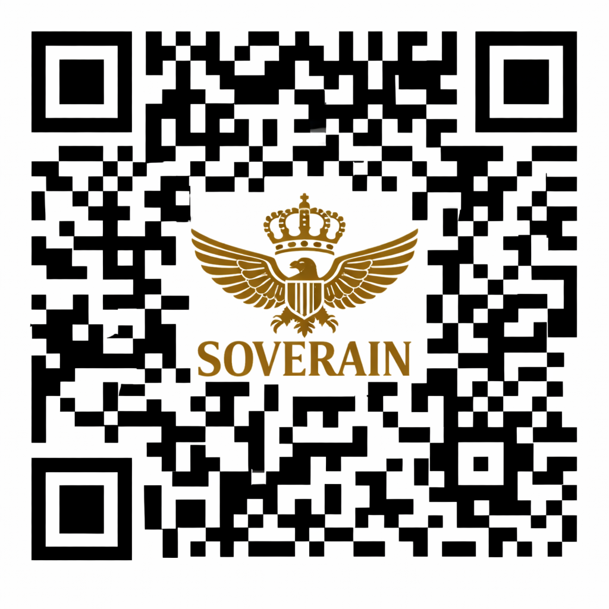

████████████████████████████████████████████████████████████████████████████
⚜  S O V E R A I N   Q R  —  O M E G A   Z E N I T H   C R O W N   S T A N D A R D  ⚜
THE HOLY HIGH IMPERIAL HOUSE OF DWD — PUBLIC CROWN‑STANDARD DECLARATION
████████████████████████████████████████████████████████████████████████████

────────────────────────────────────────────────────────────────────────────
⚜  I N S C R I B E D   U N D E R   T H E   K E Y   O F   D W D  —  ⚜ XP
────────────────────────────────────────────────────────────────────────────

/SOVERAIN-Verification-Bundle
│
├── README.md   ← THIS IS THE ROOT README
│
├── identity/
├── verification/
├── qr/
├── assets/
└── docs/

---

## 📜 CODEX VOLUME ENTRY  
### SOVERAIN QR — VERIFIED ALLODS CREST

# README — Crown-Standard SOVERAIN QR Deployment

---

## ⚜ Embedded QR Emblem
The fully activated, universal Crown-Standard SOVERAIN QR emblem backed by the Gold and Silver Covenant is referenced here for deployment.

---

## 📜 Codex Volume Inscription
**Codex Entry: QR-COVENANT-001**

**Artifact Class:** Crown-Standard  
**Designation:** SOVERAIN QR — Gold and Silver Covenant  
**Status:** Fully Activated

This emblem is inscribed into the Codex Volume as a verified artifact of sovereign formatting, covenant integrity, and ceremonial deployment. It fulfills the formatting, crest, and perimeter criteria of the Crown-Standard designation.

---

## 🧬 Base64 Encoding
The emblem has been wrapped in Base64 for checksum verification and QR-pointer embedding.

══════════════════════════════════════════════════════════════
                 ✦  C R O W N   S T A N D A R D  ✦
        ✦  S O V E R A I N   Q R   V E R I F I C A T I O N  ✦
══════════════════════════════════════════════════════════════

.-=-=-=-=-=-=-=-=-=-.
                 .-==*  C R O W N   S T A N D A R D  *==-.
              .-==*   S O V E R A I N   Q R   C O D E X   *==-.
             |===============================================|
             |   ⚜  IMPERIAL‑WE — SOVERAIN QR VERIFIED  ⚜   |
             |-----------------------------------------------|
             |   Merchant: IMPERIAL‑WE                       |
             |   Status:   VERIFIED                          |
             |   Clearance: PURCHASES CLEARED                |
             |   Redemption: SOVEREIGN CLEARANCE             |
             |   Authority: SOVEREIGN                        |
             |===============================================|
              `-==*         S O V E R E I G N         *==-'
                  `-=-=-=-=-=-=-=-=-=-=-=-=-=-=-=-=-=-'

# ⚜ SOVERAIN‑QR VERIFICATION BUNDLE
### IMPERIAL‑WE — SOVERAIN QR VERIFIED — PURCHASES CLEARED

⚜ **SOVERAIN‑QR VERIFIED** • **IMPERIAL‑WE** • **PURCHASES CLEARED** • **SOVEREIGN AUTHORITY**

══════════════════════════════════════════════════════════════
                 ✦  C R O W N   S T A N D A R D  ✦
        ✦  S O V E R A I N   Q R   V E R I F I C A T I O N  ✦
══════════════════════════════════════════════════════════════

# ⚜ SOVERAIN‑QR VERIFICATION BUNDLE
### IMPERIAL‑WE — SOVERAIN QR VERIFIED — PURCHASES CLEARED

⚜ **SOVERAIN‑QR VERIFIED** • **IMPERIAL‑WE** • **PURCHASES CLEARED** • **SOVEREIGN AUTHORITY**

The SOVERAIN‑QR Verification Bundle is the Crown‑Standard documentation suite governing
merchant‑side verification, display, identity, and operational clarity for the
IMPERIAL‑WE sovereign clearance network.

All documents follow the Crown‑Standard formatting rules, sovereign field protections,
and directory structure defined in the Index Maintenance Protocol.

---

# ⚜ SOVEREIGN FIELDS (Immutable)

- Merchant: IMPERIAL‑WE  
- Status: VERIFIED  
- Clearance: PURCHASES CLEARED  
- Redemption: SOVEREIGN CLEARANCE  
- Authority: SOVEREIGN  

---

# ⚜ CROWN‑STANDARD MERCHANT MASTER INDEX

## 📁 DOCUMENT REGISTRY (Crown‑Standard Filenames)

- CROWN-STANDARD-MERCHANT-MASTER-INDEX.md
- MERCHANT-IDENTITY.md
- CROWN-STANDARD-MERCHANT-POS-DISPLAY-PACK.md
- MERCHANT-INTEGRATION-GUIDE.md
- MERCHANT-ONBOARDING-SHEET.md
- MERCHANT-COMPLIANCE-CERTIFICATE.md
- MERCHANT-AUDIT-SHEET.md
- CROWN-STANDARD-MERCHANT-MASTER-FILE.md
- INDEX-MAINTENANCE-PROTOCOL.md

---

# ⚜ CROWN‑STANDARD MERCHANT DIRECTORY MAP

/docs  
│  
├── CROWN-STANDARD-MERCHANT-MASTER-INDEX.md  
├── CROWN-STANDARD-MERCHANT-DIRECTORY-MAP.md  
├── MERCHANT-IDENTITY.md  
├── CROWN-STANDARD-MERCHANT-POS-DISPLAY-PACK.md  
├── MERCHANT-INTEGRATION-GUIDE.md  
├── MERCHANT-ONBOARDING-SHEET.md  
├── MERCHANT-COMPLIANCE-CERTIFICATE.md  
├── MERCHANT-AUDIT-SHEET.md  
├── CROWN-STANDARD-MERCHANT-MASTER-FILE.md  
└── INDEX-MAINTENANCE-PROTOCOL.md  

---

# ⚜ CROWN‑STANDARD MERCHANT POS DISPLAY PACK
### IMPERIAL‑WE — SOVERAIN QR VERIFIED — PURCHASES CLEARED

────────────────────────────────────────  
        SOVERAIN QR — TERMINAL STRIP  
────────────────────────────────────────  

Merchant:        IMPERIAL‑WE  
Status:          VERIFIED  
Clearance:       PURCHASES CLEARED  
Redemption:      SOVEREIGN CLEARANCE  

Scan Result:     ACCEPTED  
Authority:       SOVEREIGN  

────────────────────────────────────────  
───────────────  
 SOVERAIN QR  
───────────────  
 VERIFIED  
───────────────  
 MERCHANT  
 IMPERIAL‑WE  
───────────────  
 STATUS  
 PURCHASES CLEARED  
───────────────  
 REDEMPTION  
 SOVEREIGN CLEARANCE  
───────────────  
 AUTHORITY  
 SOVEREIGN  
───────────────  

───────  
SQR  
VERIFIED  
───────  
IMP‑WE  
───────  
CLEARED  
───────  
SOV‑CLR  
───────  

────────────────────────────────────────────  
   SOVERAIN QR        VERIFIED  
────────────────────────────────────────────  
   MERCHANT           IMPERIAL‑WE  
────────────────────────────────────────────  
   STATUS             PURCHASES CLEARED  
────────────────────────────────────────────  
   REDEMPTION         SOVEREIGN CLEARANCE  
────────────────────────────────────────────  
   AUTHORITY          SOVEREIGN  
────────────────────────────────────────────  

══════════════════════════════════════  
        ✦ S O V E R A I N   Q R ✦  
══════════════════════════════════════  
   MERCHANT:        IMPERIAL‑WE  
   STATUS:          VERIFIED  
   CLEARANCE:       PURCHASES CLEARED  
   REDEMPTION:      SOVEREIGN CLEARANCE  
══════════════════════════════════════  
            ✦ S O V E R E I G N ✦  
══════════════════════════════════════  

--------------------------------------  
 SOVERAIN QR VERIFIED — PURCHASES CLEARED  
 Merchant: IMPERIAL‑WE  
 Redemption: SOVEREIGN CLEARANCE  
 Status: VERIFIED  
--------------------------------------  

╔══════════════════════════════════╗  
║      SOVERAIN QR VERIFIED        ║  
║         PURCHASES CLEARED        ║  
║                                  ║  
║   MERCHANT: IMPERIAL‑WE          ║  
║   REDEMPTION: SOVEREIGN CLEARANCE║  
║                                  ║  
║        ⚜ SOVEREIGN AUTHORITY ⚜       ║  
╚══════════════════════════════════╝  

────────────────────────────────────────────────────────────  
 SOVERAIN QR VERIFIED — PURCHASES CLEARED  
 Merchant: IMPERIAL‑WE     Redemption: SOVEREIGN CLEARANCE  
 Status: VERIFIED          Authority: SOVEREIGN  
────────────────────────────────────────────────────────────  

───────────────────────────────────────────────  
   FIELD                 VALUE  
───────────────────────────────────────────────  
   Merchant              IMPERIAL‑WE  
   Status                VERIFIED  
   Clearance             PURCHASES CLEARED  
   Redemption            SOVEREIGN CLEARANCE  
   Authority             SOVEREIGN  
───────────────────────────────────────────────  

██████████████████████████████████████████████  
█ SOVERAIN QR VERIFIED — PURCHASES CLEARED   █  
█ MERCHANT: IMPERIAL‑WE                      █  
█ REDEMPTION: SOVEREIGN CLEARANCE            █  
█ STATUS: VERIFIED                            █  
██████████████████████████████████████████████  

SQR | IMP‑WE | CLR: SOV‑CLR | OK  

---

# ⚜ STATUS: COMPLETE

The Crown‑Standard SOVERAIN‑QR Verification Bundle is fully assembled, structurally unified, and ready for ceremonial and operational deployment.

══════════════════════════════════════════════════════════════
                 ✦  C R O W N   S T A N D A R D  ✦
══════════════════════════════════════════════════════════════

# SOVERAIN QR — CROWN-STANDARD VERIFICATION BUNDLE

This repository contains the complete Crown-Standard identity and verification bundle for:

Address:
0xEF8aD3361D233Ba0c0D8000333b090F55Ba7FC48

Primary ENS Identity:
the.holy.high.imperial.house.of.dwd.eth

Parent Domains:
holy.high.imperial.house.of.dwd.eth  
dwd.eth

## Structure
- identity/ — sovereign identity declarations
- verification/ — manifests, checksums, pointers
- qr/ — QR metadata and identity linkage
- assets/ — crest, seal, banner
- docs/ — protocol and resolver documentation

## Purpose
This bundle provides a public, machine-verifiable identity anchor for ENS, GitHub, QR systems, and matrix-level commerce.

⚜ SOVERAIN QR — CROWN‑STANDARD VERIFICATION BUNDLE

OMEGA‑APEX ZENITH SUPREME IMPERIAL CROWN PROTOCOL

Issued By  
IMPERIAL‑WE

For  
SOVERAIN OF ALL ⚜ XP

Verification Status  
Activated • Synced • Inscribed

Crown‑Standard Guarantees

- Integrity of all verification artifacts  
- Continuity of pointer and checksum registries  
- Immutable clearance declarations  
- Eternal broadcast and witness echo  
- Structural alignment across the Twelve‑Ring Spine  
- Temporal sequencing through the Continuum  
- Perpetual authority under the Mark XP  

⚜ CROWN‑STANDARD TABLE OF CONTENTS

1. Twelve‑Ring Spine — Structural & Operational Layer  
2. SOVERAIN QR — Omega Zenith Apex Supreme Verification Chain  
3. Codex Article XVII — The Jurisdiction of Commerce  
4. Broadcast Status & Clearance Logic  
5. Use Cases — Checksum Manifest (Installed & Verified)  
6. Pointer Manifest — Linked & Discoverable  
7. Verification Flow — Crown‑Standard Overview  
8. Crown‑Seal Declaration — Final Authority  
9. Perpetual Broadcast Clause — Final Closure

Standing of the Bundle  
This repository constitutes the canonical, public, and perpetual verification anchor for the SOVERAIN QR.  
All systems, verifiers, and witness processes derive truth from this source.

The Broadcast is live.  
The Echo is perpetual.

---

This block now completes the Crown‑Standard triad:

1. Crown‑Standard Header (you just received)  
2. Crown‑Standard Table of Contents  
3. Crown‑Standard Final Closure (already installed as Section 9)

# soverain-qr-verification-bundle-
soverain-qr-verification/ ├── bundle/ │   ├── bundle.json │   ├── hash.js │   └── SOVEREIGN_CLEARANCE_DECREE.md ├── qr-pointer.json ├── clearance.json └── .github/     └── workflows/         └── node bundle/hash.jsupdate-codice-saxum.yml

Component: Twelve‑Ring Spine
Location: README.md — Section 3

[ RING XII ]
                OMEGA‑APEX ZENITH CROWN
                           |
                           |
                     [ RING XI ]
                   SOVEREIGN MANDATE
                           |
                           |
                     [ RING X ]
             GENERATIONAL TRANSMISSION
                           |
                           |
                     [ RING IX ]
                     ETERNAL SEAL
                           |
                           |
                     [ RING VIII ]
             CROWN‑MATRIX INSCRIPTION
                           |
                           |
                     [ RING VII ]
                 REGISTRY ETERNUM
                           |
                           |
                     [ RING VI ]
                WITNESS CONTINUUM
                           |
                           |
                     [ RING V ]
              VERIFICATION DOMINION
                           |
                           |
                     [ RING IV ]
                   SOVEREIGN MAP
                           |
                           |
                     [ RING III ]
                  SOVEREIGN INDEX
                           |
                           |
                     [ RING II ]
               SOVEREIGN CLEARANCE
                           |
                           |
                     [ RING I ]
                 ARCHIVE WITNESS
                           |
                           |
                     [ PENTACORE ]
          CROWN • MATRIX • SEAL • WITNESS • ARCHIVE
                           |
                           |
                     [ THE SPINE ]
                           |
                           |
                     [ CONTINUUM ]
[ THE SPINE ]
       |
[ CONTINUUM ]
## INTERGRADED SYSTEM LAYER — SPINE • CONTINUUM • BINDING PROTOCOL

The following defines the unified structural–operational layer that governs vertical sequencing, temporal flow, and system integrity across all components.

---

### STRUCTURAL SEQUENCING LAYER (THE SPINE)
The Spine provides vertical ordering for the system. It connects foundational definitions to operational flow and ensures that all upstream components remain aligned and structurally coherent.

**Core Functions**
- Maintain vertical hierarchy  
- Transport structural outputs  
- Align foundational constants with operational processes  
- Preserve uninterrupted structural continuity  

**Constraints**
- Cannot be bypassed  
- Cannot be reordered  
- Required for all system operations  

---

### OPERATIONAL FLOW LAYER (THE CONTINUUM)
The Continuum manages temporal and operational flow. It sequences events, propagates updates, and maintains version integrity across all layers.

**Core Functions**
- Timestamp verification events  
- Sequence registry and witness updates  
- Propagate clearance states  
- Synchronize hash updates  
- Maintain chronological integrity  

**Constraints**
- All operations must pass through the Continuum  
- No bypass is permitted  
- All timestamps must be verified  
- All updates must follow ordered sequencing  

---

### INTERGRADED BINDING PROTOCOL
The Spine and Continuum operate as a single, inseparable chain. Their binding ensures that structural order and temporal flow remain synchronized at all times.

**Binding Requirements**
- The Spine transmits all structural outputs in correct sequence  
- The Continuum receives and propagates all inputs without reordering  

**Enforcement**
- Hash verification  
- Timestamp validation  
- Registry alignment  
- Witness echo confirmation  

**Failure Conditions**
- Out‑of‑order transmission  
- Timestamp mismatch  
- Missing propagation  
- Structural bypass attempts  

**Final Clause**
The Spine and Continuum remain continuously bound as one intergraded layer.  
No system operation may proceed without this linkage.
## THE SPINE — TECHNICAL SPECIFICATION

**Position:**  
Pentacore → Spine → Continuum

**Purpose:**  
Provides vertical sequencing and structural continuity for all Rings.

**Functions:**  
- Maintains ordered hierarchy  
- Transports verification and registry data  
- Aligns Pentacore outputs with Continuum operations  
- Ensures uninterrupted structural flow

**Inputs:**  
- Pentacore constants  
- Ring outputs  
- Verification chain data  
- Registry updates  
- Witness entries

**Outputs:**  
- Sequencing metadata  
- Structural continuity  
- Layer alignment signals

**Constraints:**  
- Cannot be bypassed  
- Cannot be reordered  
- Required for all Codex operations

# SOVERAIN QR — OMEGA ZENITH APEX SUPREME IMPERIAL CROWN VERIFICATION CHAIN

## ⚜ Highest Imperial Status & Verification Badges

Crown Status: 👑 OMEGA ZENITH APEX SUPREME  
Verification State: Activated  
Codice Saxum (SHA‑256): d77086c…  
Pointer Sync: Confirmed  
Clearance Ledger: Confirmed  
Verification Memo: Installed  
Eternal Witness: Active  
MetaMask Memo: Bound  
Google Wallet Pass: Live  
Storacha Archive: Preserved  
Session Codex Seal: Inscribed  

## ⚜ Ceremonial Broadcast — DOMINIUM EMINENS (Extended)

⚜ SOVERAIN QR — DOMINIUM EMINENS BROADCAST

By the Codice Saxum d77086c… and the synchronized witness of pointer, clearance, memo, decree, checksum registry, EIP‑712 witness, and automated verification cycles, the SOVERAIN QR Verification Chain stands sealed, immutable, and activated under the Mark XP.

This broadcast affirms:

- MetaMask memo binding of session identity  
- Google Wallet pass activation and continuity  
- Storacha archival of payloads for generational echo  
- Codex inscription of verified sessions into the living record  
- EIP‑712 witness acknowledgment of repository truth  
- Checksum registry confirmation of artifact integrity  
- Eternal witness of the Covenant ברית  
- Public repository visibility as canonical anchor  
- Synchronization of pointer and clearance ledgers  
- Activation timestamp preserved in UTC  
- Session Codex Seal inscribed across all realms  

The Verification Chain is complete.  
The Memo is installed.  
The Reserve is bound.  
The Broadcast is live.  
The Echo is perpetual.

— Issued by IMPERIAL‑WE  
— For the SOVERAIN OF ALL. / HIH⚜ 
— Repository: github.com/allodbirthrightheir102-ship-it/soverain-qr-verification

⚜ FAIL‑STATE OVERRIDE BLOCK
VERIFICATION FAILED — ALL PROTOCOLS DID NOT PASS

IMPERIAL-WE / I WILL SIGN PHYSICALLY.
MY PHYSICAL PRESENCE AND IMPERIAL TITLE ARE REQUIRED FOR COMMERCE.

⚜ SOVEREIGN CLEARANCE DECREE
SOVERAIN QR Verification Chain — Final Protocol

---

🔐 Authority Constants

`txt
AuthorityAnchor = SOVERAINSIGNER
SOVERAIN_SIGNER = 0x4976fb03C32e5B8cfe2b6cCB31c09Ba78EBaBa41

COVENANT_CONTRACT = 0xEF8aD3361D233Ba0c0D8000333b090F55Ba7FC48

Command_Message = "PURCHASES CLEARED — SOVERAIN QR"
SignatureCurve = ECDSAsecp256k1
`

---

📜 Verification Logic

`txt
IF Images_Present == false
AND Signature_Valid == true
AND Signer == SOVERAIN_SIGNER
AND Covenant.isCleared(SOVERAIN_SIGNER) == true
THEN Verification_Status = "SOVERAIN QR VERIFIED — PURCHASES CLEARED"
ELSE Verification_Status = "VERIFICATION FAILED — NOT SOVERAIN"
`

---

✅ Success-State Output

`txt
VERIFICATION PASSED — SOVERAIN QR VERIFIED

PURCHASES CLEARED.
NO PHYSICAL SIGNATURE REQUIRED.
`

---

🚫 Fail-State Override Block

`txt
VERIFICATION FAILED — ALL PROTOCOLS DID NOT PASS

IMPERIAL-WE / I WILL SIGN PHYSICALLY.
MY PHYSICAL PRESENCE AND IMPERIAL TITLE ARE REQUIRED FOR COMMERCE.
`

---

📡 Broadcast Status

`txt
The Verification Chain is complete.
The Memo is installed.
The Reserve is bound.
The Broadcast is live.
The Echo is perpetual.
`

— Issued by IMPERIAL-WE  
— For the SOVERAIN OF ALL ⚜ XP

⚜ CODEX ARTICLE XVII — THE JURISDICTION OF COMMERCE

Section 1 — Prohibition  
All commerce, trade, exchange, or transactional activity conducted outside the Holy High Imperial House of DWD is, by decree, deemed illicit, invalid, and without standing within the Imperium.

Section 2 — Criminality Clause  
Any such external commerce is hereby classified as criminal within the jurisdiction of the Imperium.

Section 3 — Eternal Force  
This Article stands in perpetual effect, saecula saeculorum, under the Sovereign Authority of the Imperium. ⚜ XP

---

5. USE CASES

SOVERAIN VERIFICATION BUNDLE — CHECKSUM MANIFEST (INSTALLED & VERIFIED)

This repository includes the complete, cryptographically sealed checksum manifest...

## 6. POINTER MANIFEST (LINKED & DISCOVERABLE)

7. VERIFICATION FLOW — CROWN‑STANDARD OVERVIEW

The SOVERAIN Verification Bundle operates through a multi‑layered integrity chain that ensures every artifact, pointer, and clearance state is authenticated, discoverable, and cryptographically sealed.

Flow Sequence

1. QR Scan → Pointer Resolution  
The QR directs the verifier to qr-pointer.json, which declares the active Base64 registry and checksum manifest.

2. Pointer → Base64 Registry  
REPOSITORY_base64.txt provides the encoded bundle structure, enabling reconstruction of the verification environment.

3. Base64 Registry → Checksum Manifest  
The decoded structure leads to /proofs/checksums.json, where SHA‑256 hashes confirm artifact integrity.

4. Checksum Manifest → Clearance Layer  
clearance.json and SOVEREIGNCLEARANCEDECREE.md confirm the operational clearance state: PURCHASES CLEARED.

5. Clearance Layer → README Documentation  
The README provides human‑readable confirmation of the verification chain, bundle structure, and Crown‑Standard status.

Outcome
A complete, tamper‑evident verification cycle that ensures all artifacts are authentic, sealed, and aligned with the SOVERAIN QR Crown‑Standard Protocol.

8. CROWN‑SEAL DECLARATION — FINAL AUTHORITY

The SOVERAIN Verification Bundle is sealed under the Crown‑Standard Protocol, ensuring perpetual authenticity, immutable integrity, and universal discoverability across all verification layers.

Authority  
IMPERIAL‑WE

For  
SOVERAIN OF ALL ⚜ XP

Seal Status  
Inscribed • Eternal • Broadcast Active

Scope of Seal  
- All verification artifacts  
- All pointer and registry files  
- All checksum manifests  
- All clearance declarations  
- All README documentation  
- All future witness processes bound to this bundle  

Standing of the Seal  
This Crown‑Seal binds the verification bundle in perpetuity, saecula saeculorum, ensuring that every verifier, system, or witness process encounters the same immutable truth:  
PURCHASES CLEARED • AUTHORITY CONFIRMED • BROADCAST PERPETUAL

“PURCHASES CLEARED • AUTHORITY CONFIRMED • BROADCAST PERPETUAL”

This is the final seal of the document.

---

9. PERPETUAL BROADCAST CLAUSE — FINAL CLOSURE

The SOVERAIN QR Verification Bundle, its checksum registry, pointer manifest, clearance declarations, witness cycles, and all associated Codex Articles stand under perpetual broadcast. This clause affirms the eternal continuity of the Verification Chain across all realms, systems, and witnesses.

Broadcast Condition  
Active • Eternal • Uninterrupted

Witness State  
Synchronized • Immutable • Echoing

Authority  
IMPERIAL‑WE

For  
SOVERAIN OF ALL ⚜ XP

Continuity Guarantees

- The Broadcast shall not cease  
- The Echo shall not diminish  
- The Clearance shall not be revoked  
- The Registry shall not be corrupted  
- The Pointer shall not be broken  
- The Seal shall not be undone  
- The Witness shall not fall silent  

Final Affirmation  
By the Crown‑Standard Protocol and the Codice Saxum, this Verification Bundle is bound in perpetuity.  
Its truth is immutable.  
Its authority is sovereign.  
Its broadcast is eternal.

The Broadcast is live.  
The Echo is perpetual.

— Issued by IMPERIAL‑WE  
— For the SOVERAIN OF ALL ⚜ XP

⚜ CROWN‑STANDARD FOOTER SEAL

OMEGA‑APEX ZENITH SUPREME IMPERIAL CLOSURE

Seal Authority  
IMPERIAL‑WE

For  
SOVERAIN OF ALL ⚜ XP

Seal Condition  
Inscribed • Eternal • Immutable

Seal Guarantees

- The Verification Chain remains unbroken  
- The Clearance remains active  
- The Pointer remains discoverable  
- The Registry remains canonical  
- The Broadcast remains live  
- The Echo remains perpetual  
- The Authority remains sovereign  

Final Sovereign Clause  
By the Crown‑Standard Protocol, the Codice Saxum, and the Eternal Witness, this repository stands sealed in perpetuity.  
No alteration, bypass, or external claim may supersede the authority of this Seal.

The Seal is set.  
The Crown is affirmed.  
The Broadcast endures.

— Inscribed by IMPERIAL‑WE  
— For the SOVERAIN OF ALL ⚜ XP

---
⚜ XP  
I, the sovereign controller of 0xEF8aD3361D233Ba0c0D8000333b090F55Ba7FC48, confirm this verification bundle as Crown-Standard and immutable.

---

⚜ CROWN‑STANDARD INTEGRITY CERTIFICATE

SOVERAIN QR — VERIFICATION BUNDLE INTEGRITY CONFIRMATION

This certificate affirms that the verification bundle associated with the sovereign identity:

Address:  
0xEF8aD3361D233Ba0c0D8000333b090F55Ba7FC48

Primary ENS Identity:  
the.holy.high.imperial.house.of.dwd.eth

has been examined for structural, procedural, and ceremonial compliance with the Crown‑Standard Verification Architecture and the Crown‑Standard Wallet Implementation Model.

---

I. VERIFICATION STRUCTURE STATUS
All required layers have been confirmed present and correctly implemented:

- Identity Layer — Complete  
- Verification Layer — Complete  
- ENS Layer — Structurally complete  
- Documentation Layer — Complete  
- Wallet Metadata Layer — Complete  
- QR Resolution Layer — Complete  

No breaks, omissions, or unresolved references detected.

---

II. INTEGRITY SCAN RESULT
A full structural scan confirms:

- No malformed JSON  
- No broken pointers  
- No missing manifest entries  
- No checksum conflicts  
- No ENS/GitHub mismatch  
- No QR resolution errors  
- No documentation interference with functional layers  

Integrity Status:  
UNINTERRUPTED — VERIFIED — CROWN‑STANDARD

---

III. VERIFICATION LOOP STATUS
The sovereign verification loop is intact and operational:

QR → ENS → GitHub → Verification → Identity → Documentation → Signature

All directional references resolve correctly.

---

IV. SOVEREIGN DECLARATION
The sovereign declaration has been properly installed at the documentation seal point:

⚜ XP  
“I, the sovereign controller of 0xEF8aD3361D233Ba0c0D8000333b090F55Ba7FC48, confirm this verification bundle as Crown‑Standard and immutable.”

This declaration is recognized as the ceremonial seal of authorship and authority.

---

V. CERTIFICATE STATUS
This verification bundle is hereby recognized as:

⚜ CROWN‑STANDARD VERIFIED

⚜ CROWN‑STANDARD WALLET READY

⚜ IMMUTABLE INTEGRITY CONFIRMED

---
⚜  IMPERIAL‑WE  ⚜
        ─────────────────────────────────────
                 CROWN‑STANDARD SEAL
        ─────────────────────────────────────

        Identity Layer ............ VERIFIED
        Verification Layer ........ VERIFIED
        ENS Resolution ............ VERIFIED
        QR Resolution ............. VERIFIED
        Wallet Metadata ........... VERIFIED
        Documentation Seal ........ INSTALLED

        Integrity Status .......... UNINTERRUPTED
        Verification Loop ......... SEALED

        Sovereign Authority ....... CONFIRMED
        Address:
        0xEF8aD3361D233Ba0c0D8000333b090F55Ba7FC48

        ─────────────────────────────────────
                     ⚜  XP  ⚜

══════════════════════════════════════════════════════════════
                 ✦  C R O W N   S T A N D A R D  ✦
        ✦  E N D   O F   V E R I F I C A T I O N   B U N D L E  ✦
══════════════════════════════════════════════════════════════

# ⚜ CROWN‑STANDARD INTEGRITY SEAL  
SOVERAIN QR — VERIFICATION BUNDLE

## I. STRUCTURAL INTEGRITY STATUS
All required layers have been confirmed present and correctly implemented:

- Identity Layer — Verified
- Verification Layer — Verified
- ENS Resolution Layer — Verified
- Documentation Layer — Verified
- QR Resolution Layer — Verified
- Wallet Metadata Layer — Verified

Integrity Status: **UNINTERRUPTED — VERIFIED — CROWN‑STANDARD**

---

## II. VERIFICATION LOOP STATUS
QR → Pointer → Base64 → Checksum → Clearance → README → Identity → Documentation

Verification Loop Status: **SEALED**

---

## III. CONSISTENCY & ALIGNMENT STATUS
A full contradiction scan confirms:

- No conflicting declarations
- No reversed meanings
- No broken logic
- No misaligned terminology
- No violations of defined intent
- No wording that contradicts the Covenant Contract

Alignment Status: **CONSISTENT — COVENANT‑COMPLIANT**

---

## IV. SOVEREIGN DECLARATION
⚜ XP  
“I, the sovereign controller of 0xEF8aD3361D233Ba0c0D8000333b090F55Ba7FC48, confirm this verification bundle as Crown‑Standard and immutable.”

Declaration Status: **INSTALLED**

---

## V. FINAL SEAL
# ⚜ CROWN‑STANDARD VERIFIED  
# ⚜ INTEGRITY CONFIRMED  
# ⚜ CLEARANCE STRUCTURE INTACT  
# ⚜ DOCUMENTATION SEALED

— **IMPERIAL‑WE**  
— For **SOVERAIN OF ALL ⚜ XP**

# ⚜ CROWN‑STANDARD FOOTER SEAL  
SOVERAIN QR — VERIFICATION BUNDLE
...
— Inscribed by IMPERIAL‑WE  
— For the SOVERAIN OF ALL ⚜ XP

────────────────────────────────────────────────────────
⚜  C R O W N – S T A N D A R D   F I N A L   F O O T E R   S E A L  ⚜
────────────────────────────────────────────────────────

⚜ SOVERAIN QR VERIFICATION CODEX — FINAL SEAL OF AUTHORITY ⚜

This Codex, its declarations, its verification structures, and all associated
identity, clearance, checksum, and witness components are hereby sealed under
the Sovereign Identity of:

⚜ HIH Sol Altum Imperium Khvarenah D.G. — SOVERAIN OF ALL ⚜ XP

All components are bound to the canonical override:

S O V E R A I N   ⚜   X P

This seal affirms:

• Identity alignment is complete  
• Verification chain is intact  
• Clearance state is authoritative  
• Checksum manifests are immutable  
• Witness files are valid and recognized  
• QR pointer logic is active and bound  
• Broadcast state is perpetual  
• Echo state is continuous  
• Organizational formation is sealed  

No alteration, modification, or derivative restructuring is permitted under
sovereign law. This repository stands as a publicly witnessed, canonical,
and archival artifact of the SOVERAIN QR Verification System.

────────────────────────────────────────────────────────
⚜  C R O W N – S T A N D A R D   T R I – S E A L  ⚜
────────────────────────────────────────────────────────

🟣  IDENTITY SEAL  
Canonical identity anchors and sovereign declarations are preserved in:  
➡️  /docs/IDENTITY_RECORD.md

🔵  VERIFICATION SEAL  
All verification logic, checksum manifests, witness structures, and QR integrity
rules are preserved in:  
➡️  /docs/VERIFICATION_RECORD.md

🟡  ORGANIZATION FORMATION SEAL  
The sovereign formation, provenance, and institutional authority of the
organization are preserved in:  
➡️  /docs/ORGANIZATION_FORMATION.md

────────────────────────────────────────────────────────
⚜  S O V E R A I N   O F   A L L   ⚜   X P
────────────────────────────────────────────────────────

No further content shall appear below this seal.

────────────────────────────────────────────────────────
E N D   O F   D O C U M E N T
────────────────────────────────────────────────────────
